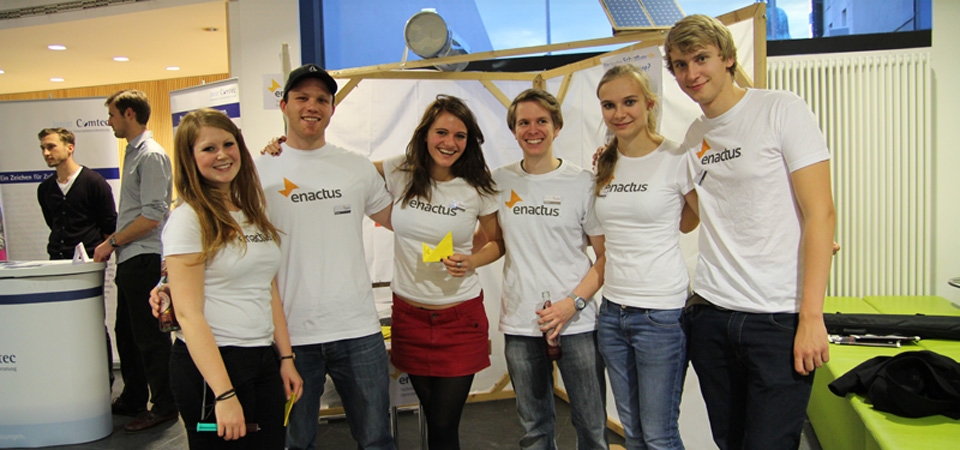
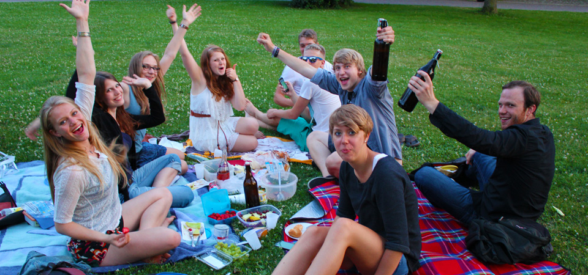
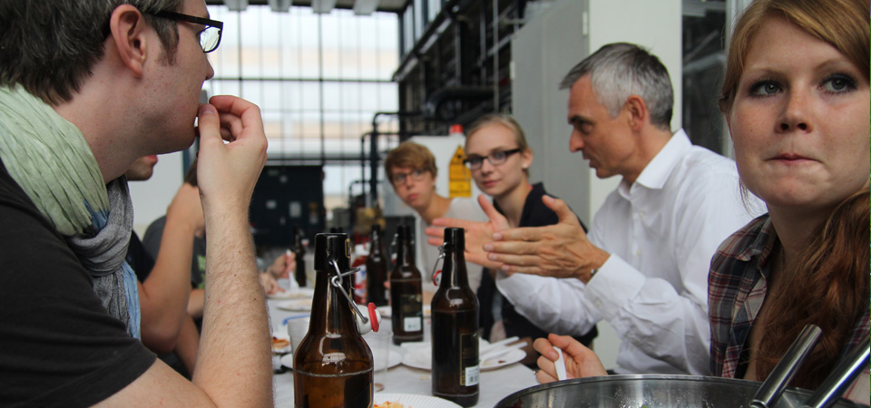
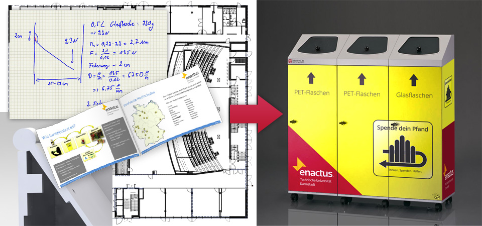

Enactus ist eine internationale Studierendenorganisation und eine eigenständig akkreditierte Hochschulgruppe an der Technischen Universität mit dem Ziel soziale Projekte nachhaltig und unternehmerisch umzusetzen, um Menschen in benachteiligten Lebenssituation eine wirtschaftliche Perspektive zu schaffen. Dabei hilft die Dachorganisation eine Infrastruktur zum Austausch zwischen den Hochschulgruppen an den verschiedenen Standorten aufzubauen und sorgt durch jährliche Karrieremessen und Wettbewerben für zahlreiche Veranstaltungen, um Kontakt zu Unternehmensvertretern herzustellen.
An der Technischen Universtität wurde die Hochschulgruppe Enactus 2011 gegründet. Nach ihrem Raketenstart und der Präsentation der Projektideen auf dem Landeswettbewerb ist die Gruppenstruktur vollständig zusammengebrochen. Von den einst 9 Mitgliedern ist nur noch ein Kern von 3 Mitgliedern Anfang 2013 übrig geblieben. Ab diesem Zeitpunkt habe ich das Amt des Teamleiters übernommen.

Zu Beginn habe ich versucht die Teamstruktur durch ein Teamtraining aufzubauen. Im Anschluss daran haben wir uns darauf konzentriert welche Projekte wir in Zukunft umsetzen möchten und welche Ziele wir uns für das Jahr 2013 setzen möchten. Danach haben wir begonnen, die Projekte voranzutreiben, um dabei den Fokus auf das Anwerben von neuen Mitgliedern nicht aus den Augen zu verlieren. Neben verschiedenen Veranstaltungen wie Picknicks, einem Sommerfest und der Wahrnehmung von verschiedenen Veranstaltungen konnten wir zum Start des Wintersemester 2013 / 2014 auf 10 Mitglieder wachsen. Der Erfolg bei unserem Projekt Spende-dein-Pfand sorgte dafür, dass wir auf den folgenden Erstsemesterbegrüßungen viele neue Interessenten für unsere Arbeit begeistern konnten.

Seit Mitte Juni 2014 habe ich das Amt des Teamleiters abgegeben und kann auf ein erfolgreiches Jahr zurückschauen. Das Team ist seit dem von 3 auf 20 Mitglieder gewachsen, wir haben neue Business Advisors akquirieren können, wir konnten uns in der Universität als Hochschulgruppe etablieren und einen eigenen Raum erhalten und unser Netzwerk zu anderen Hochschulgruppen und Enactus Teams innerhalb Deutschlands ausbauen.

Weitere Informationen unter http://www.enactus-darmstadt.de, http://www.enactus.de oder http://www.enactus.org

