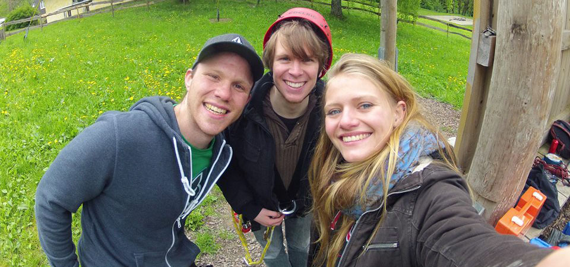
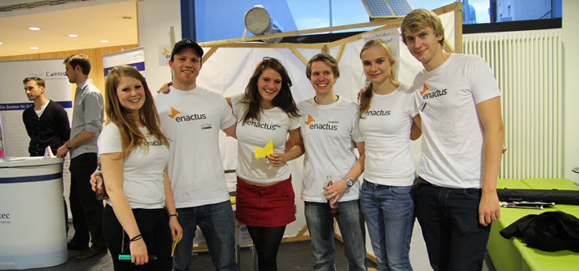
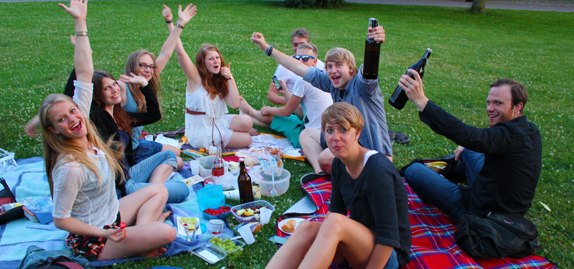
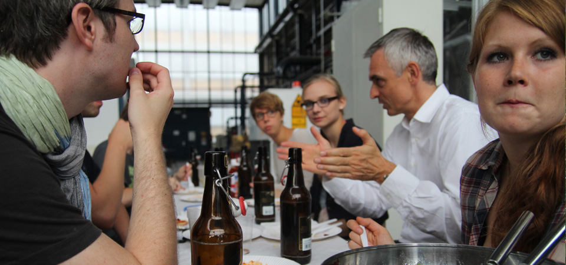
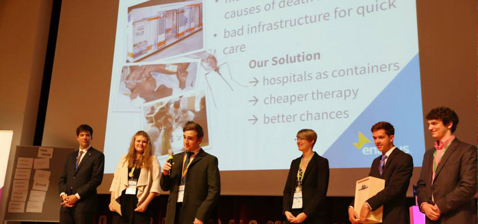
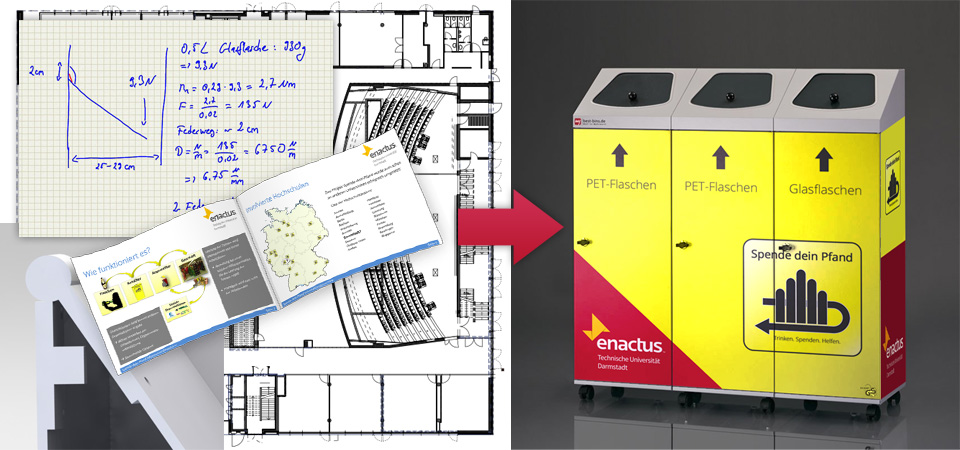

Enactus is an international student organisation and an independently accredited university group at the University of Technology with the aim of implementing social projects in a sustainable and entrepreneurial way in order to create economic perspectives for people in disadvantaged living situations. The umbrella organisation helps to build up an infrastructure for exchange between the university groups at the various locations and organises numerous events through annual career fairs and competitions to establish contact with company representatives.

At the Technische Universtität, the Enactus university group was founded in 2011. After its rocket start and the presentation of the project ideas at the national competition, the group structure completely collapsed. From the former 9 members, only a core of 3 members remained at the beginning of 2013. From that point on, I took over as team leader.

At the beginning, I tried to build up the team structure through team training. After that, we concentrated on which projects we would like to implement in the future and which goals we would like to set for 2013. After that, we started to push the projects forward, not losing sight of the focus on recruiting new members. In addition to various events such as picnics, a summer party and awareness of various events, we were able to grow to 10 members at the start of the winter semester 2013 / 2014. The success with our donate-your-pledge project ensured that we were able to inspire many new people interested in our work at the following freshers' welcome events.

Since mid-June 2014, I have stepped down as team leader and can look back on a successful year. Since then, the team has grown from 3 to 20 members, we have been able to acquire new business advisors, we have been able to establish ourselves as a university group at the university and get our own room, and we have been able to expand our network to other university groups and Enactus teams within Germany.

Further information at http://www.enactus-darmstadt.de, http://www.enactus.de or http://www.enactus.org

