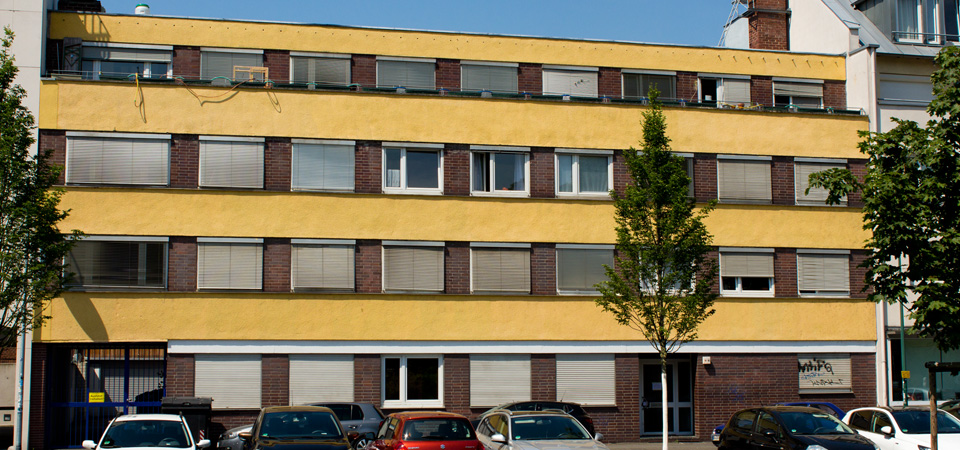
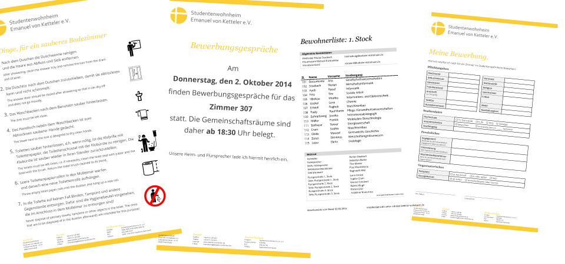
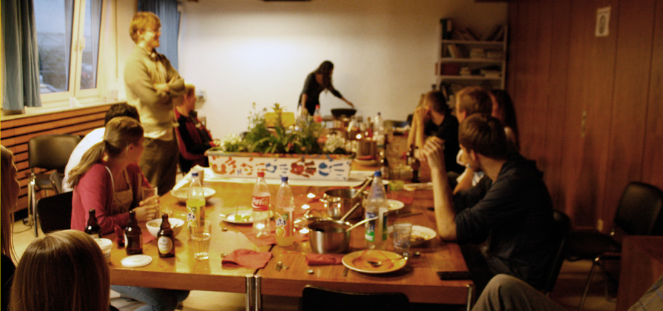
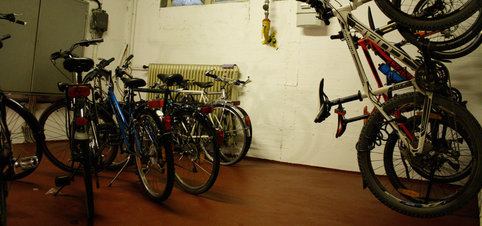


Im Studentenwohnheim Emanuel-von-Ketteler leben 43 Studentinnen und Studenten verschiedener Herkunft, Religionszugehörigkeiten, Fachrichtungen und Interessen miteinander. Auf drei Stockwerken benutzen sie Küche, Duschen und Toiletten gemeinsam. Das sehr zentral gelegene Haus wurde 1967 erbaut und feierte 2018 sein 50 jähriges Jubiläum. Träger ist der Studentenwohnheim Emanuel von Ketteler e.V., ein Verein katholischer Akademiker, die Mitglieder im Bund Neudeutschland (ND) Darmstadt sind. Das besondere an diesem Wohnheim ist die studentische Selbstverwaltung. Der Heimrat, bestehend aus Flursprechern aus allen drei Stockwerken, Heimsprecher und stellvertretender Heimsprecher sowie der Heimleiter bilden das Entscheidungsgremium im Wohnheim und werden demokratisch von den Bewohnern gewählt.


**Anfang 2014** bin ich in das Wohnheim eingezogen. Nach etwa 6 Monaten als **stellvertretender Heimsprecher** wurde ich Ende 2014 vom Vorstand des Trägervereins zum **Heimleiter** ernannt. **Bis 2019** war ich verantwortlich für das Erstellen der Mietverträge und die damit verbundenen Ein- und Auszüge der Bewohner, das Einhalten der Hausordnung und Organisation des Zusammenlebens der Bewohner. In Zusammenarbeit mit dem Vorstand des Trägervereins habe ich das Wohnheim strategisch mit weiterentwickelt.

Ich habe in dieser Zeit viel über die sozialen und zwischenmenschlichen Beziehungen gelernt. Versucht bei Streitigkeiten zu vermitteln und deeskalierend einzugreifen und für alle Bewohner eine zufriedenstellende Lösung zu finden. Es war nicht immer leicht hat aber die meiste Zeit viel Spaß gemacht.

Einige Projekte, die ich in diesem Wohnheim umsetzen konnte waren:

- Renovierung des Fahrradkellers
- Funktionierender, digitaler Prozess zur Meldung der Zimmerbelegung
- Installation von flächendeckendem WLAN
- Einrichtung eines Wohnheims-Intranet mit allen Protokollen, Bewohnerdaten, Hilfen, etc.
- Design einer Corporate Identity für das Wohnheim
- Mitorganisation der 50 Jahr-Feier
- Einrichtung und Pflege des Social Media Auftritts

Weitere Informationen unter https://www.ketteler-wohnheim.de/

