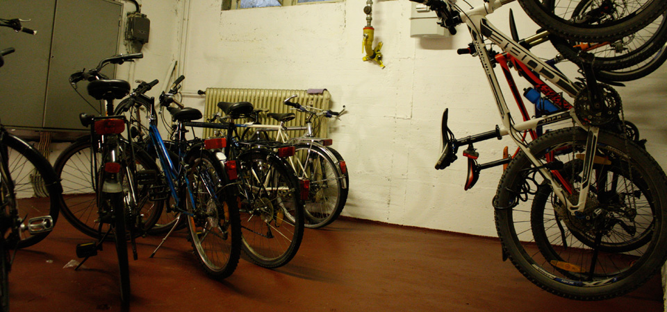


In the Emanuel-von-Ketteler student hall of residence, 43 students from different backgrounds, religious affiliations, disciplines and interests live together. They share the kitchen, showers and toilets on three floors. The very centrally located house was built in 1967 and celebrated its 50th anniversary in 2018. The responsible body is the Studentenwohnheim Emanuel von Ketteler e.V., an association of Catholic academics who are members of the Bund Neudeutschland (ND) Darmstadt. The special feature of this hall of residence is student self-administration. The dormitory council, consisting of hall representatives from all three floors, dormitory spokesperson and deputy dormitory spokesperson as well as the dormitory manager form the decision-making body in the dormitory and are democratically elected by the residents.


I moved into the residence at the **beginning of 2014**. After about 6 months as **deputy home speaker**, I was appointed **home manager** by the board of the supporting association at the end of 2014. **Until 2019** I was responsible for drawing up the tenancy agreements and the associated move-ins and move-outs of the residents, complying with the house rules and organising the residents' coexistence. In cooperation with the board of the supporting association, I helped to strategically develop the residence.

I learned a lot about social and interpersonal relationships during this time. I tried to mediate and de-escalate disputes and find a satisfactory solution for all residents. It wasn't always easy but most of the time it was a lot of fun.

Some of the projects I was able to implement in this residence were:

- Renovation of the bicycle storage room
- Functioning, digital process for reporting room occupancy
- Installation of comprehensive WLAN
- Setting up a dormitory intranet with all protocols, resident data, assistance, etc.
- Design of a corporate identity for the hall of residence
- Co-organisation of the 50th anniversary celebration
- Setting up and maintaining the social media presence

Further information at https://www.ketteler-wohnheim.de/

