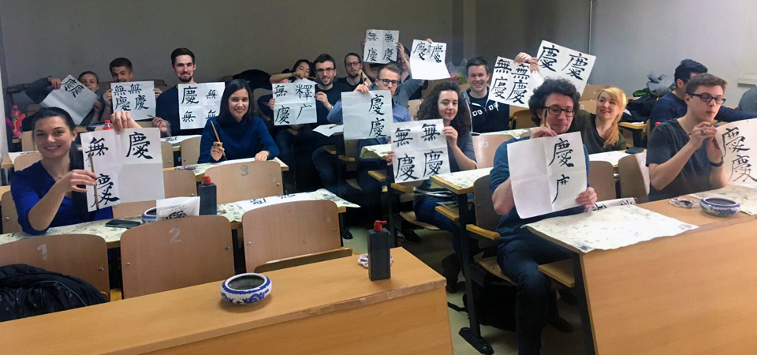
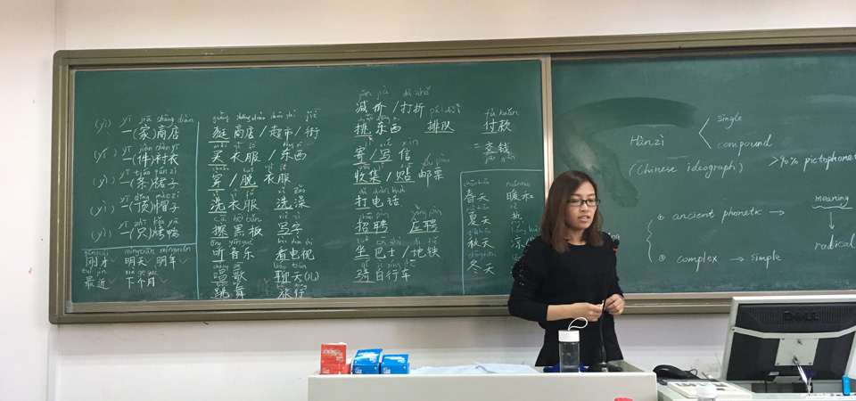


Das Studentenprogramm „Seeds for the Future“, Saat für die Zukunft, heißt das Angebot, mit dem sich Huawei, das globale Telekommunikationsunternehmen mit Hauptsitz in Shenzhen, an Studenten wendet. Der Konzern bedient 170 Länder mit Smartphones, Tablets und PCs sowie Dienstleistungen für Netzwerkinfrastrukturen. In Deutschland ist das Unternehmen seit 2001 vertreten. Das Studentenprogramm gibt es in 67 Ländern.


2017 wurde ich als einer von 20 Studenten aus über 300 Bewerbern ausgewählt China in Begleitung von Huawei kennen zu lernen. Das Programm beinhaltete neben allen Reisekosten jede Menge Kulturveranstaltungen. Dazu gehören:

- Chinesischer Sprachkurs
- Kalligraphiekurs der chinesischen Schriftzeichen
- Reisen nach Peking, Shanghai, Shenzhen, Hongkong
- Besuch des chinesischen Zirkus
- Zahlreiche kulinarische Abenteuer
- Huawei-Headquarter mit Intensivkurs zu neuen Kommunikationstechnologien (5G, VoLTE, FTTH)

Weitere Informationen unter http://www.huawei-studentenprogramm.de

