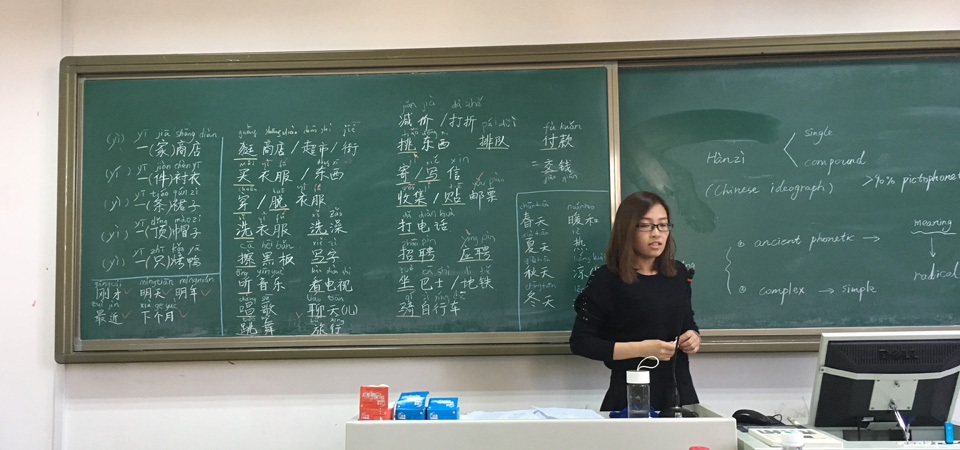


The student programme "Seeds for the Future" is the name of the offer with which Huawei, the global telecommunications company with headquarters in Shenzhen, is addressing students. The group serves 170 countries with smartphones, tablets and PCs as well as services for network infrastructures. The company has been represented in Germany since 2001. The student programme exists in 67 countries.


In 2017, I was selected as one of 20 students from over 300 applicants to get to know China in the company of Huawei. The programme included all travel expenses and lots of cultural events. These include:

- Chinese language course
- Calligraphy course of Chinese characters
- Trips to Beijing, Shanghai, Shenzhen, Hong Kong
- Visit to the Chinese circus
- Numerous culinary adventures
- Huawei headquarters with intensive course on new communication technologies (5G, VoLTE, FTTH)

Further information at http://www.huawei-studentenprogramm.de

