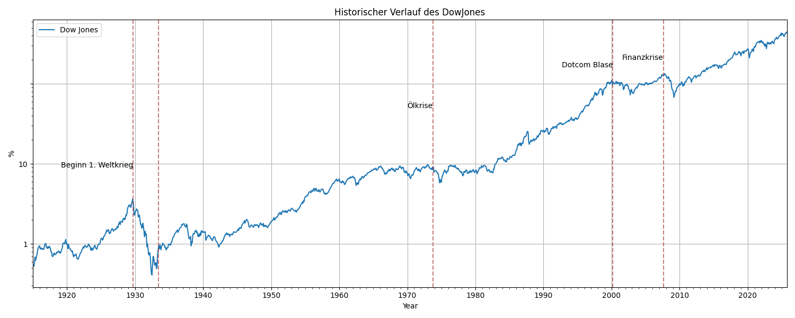
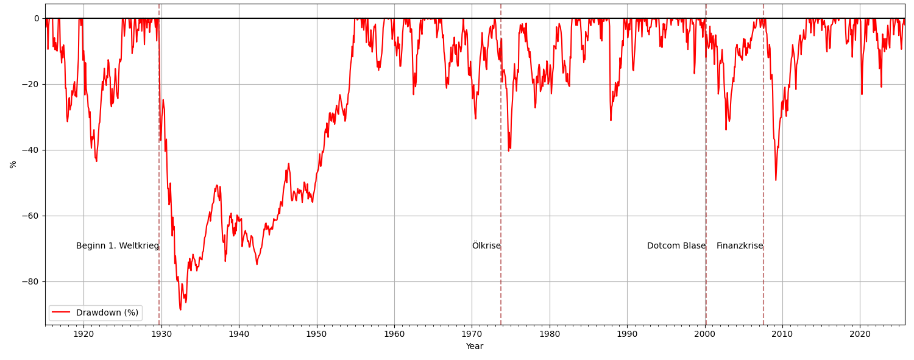
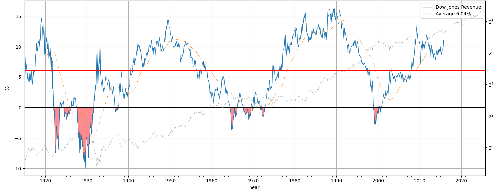
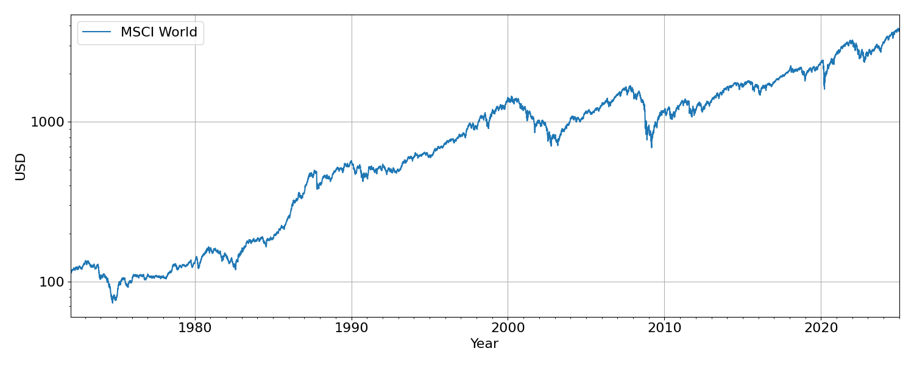
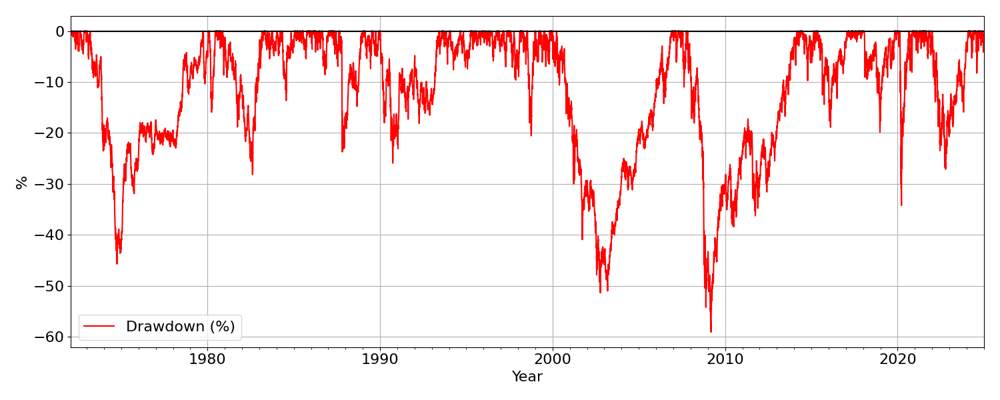
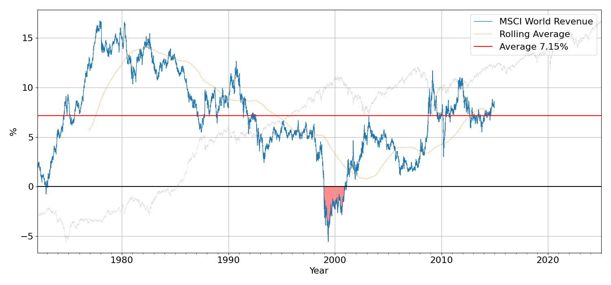
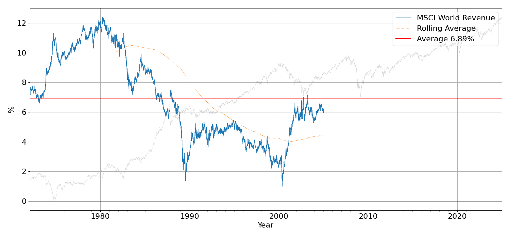

INTRO

### Dow Jones

#### History of the Dow Jones

The Dow Jones Industrial Average (DJIA) — often just called "the Dow" — is one of the most well-known indicators of how the stock market in the United States is doing. Think of it like a scoreboard for the economy. It tracks the stock prices of 30 major companies that are leaders in industries like technology, finance, healthcare, and consumer goods in the United States. Because it only includes 30 companies it doesn’t represent the entire stock market and cannot explain fully the whole market. But one advantage of the Dow Jones is, that is tracking the market development since 1896 and this gives us a good insight in history.

As we can see, quite a few of very important market happenings can be seen here. Naming:

- the start of the **World War 2** in 1929
- the **oil crises** in the 1970s
- the **burst of the dotcom bubble** in the beginning of the 2000s
- the **financial crisis** in 2007
- the beginning of the **corona pandemic** in 2020

#### Risk Awareness

We can now have a more insight look of how these crisis were impacting the stock market by checking the maximum drawdown from the All time high.

We can see that the most severe impact to the financial market was the **beginning of world war 2** which caused the market to crash by almost 90%. All the other following crisis had an impact of "only" up to 50%. The most servere was the financal crisis with 48%. The corona pandemic and the burst of the dotcom bubble was comparable low with up to 30% draw down. Still the market always recovered. This is actually very visible if we look at the rolling yearly revenue after 10 years of investing.

#### The long run is positive

This graph shows for every date during the last 100 years, how your yearly revenue would have been, if you would have invested that day and hold the asset for 10 years. We can see, that if you would have invested in 1929, you would have had a yearly loss of around 10% p.a for the upcoming 10 years. Same is, if you would have played on the stock market just before the burst of the dotcom bubble, you would have had no profit during the next 10 years.

On the other hand, in the last 100 years there have been only accomulated time periods of about 15 years, where you would not have made any profits. The other more than 85 years, would have brough profits up to 15% every year.

### Deviate an investment strategy

We can use that knowledge to come up with a good strategy to invest into the stock market. Because it turns out, that if we invest in a diversified portfolio of companies, we can make profit in the long run with a rather limited risk exposure. The Dow Jones was just an exmaple, because it is very old. As mentioned earlier, it is not a good asset portfolio, because it only contains 30 companies and they are all based in the US. We need something more diversified.

#### The World Index

Here the **MSCI World** can help us. The MSCI World Index is like a global snapshot of the stock market. It tracks the performance of over 1,600 large and mid-sized companies across 23 developed countries, including the US, Japan, Germany, the UK, and Australia. It’s one of the most popular tools for understanding how the global economy is doing. Investors use it to diversify—meaning they spread their money across many countries and industries to reduce risk. It’s the backbone of many ETFs (Exchange-Traded Funds), which let everyday people invest in hundreds of companies at once. So we can use such an ETF to build up a global, diversified portfolio.

#### Risk Awareness

Similar as for the Dow Jones, we will see, that the MSCI World Index has similar drawdown rates. However certain market areas might be more impacted than the US and lead to shortly higher losses and therefore a higher volatility. The financial crises, the crises with the so far biggest impact on the MSCI World Index caused a drawdown of almost 60%. Also the burst of the dotcom bubble brough the Index about 50% down.

#### The long run is positive

So we will also look at, how your yearly revenue would have been, if you would have invested on any day and hold the asset for 10 years. We see, that there as been only one bad time, to start investing into the MSCI World, which would have been directly before the dotcom bubble bursted. If you did, even after 10 years, you would have not made any profit.

However, all the other times, investing into MSCI World and holding it for 10 years would have brought you yearly renenue of up to 16% p.a. And in average over all time periods you would have get 7% every year.

Let's have a look, how the situation will change, if you hold the asset for 20 instead of 10 years. We see, that even if you would have invested just before the burst of the dotcom bubble, you would still receive 1% of revenue every year. And in average almost 7% would have paid to your account if you would have invested on any date and hold the asset for 20 years.

### Conclusion

So basically, according to the data one can say, that investint into a diversified portfolio will give you a good return of investment while having a moderate risk exposure. It is important, to not get scared, when the market goes down. But instead, keep holding the asset and wait. In the long run, it will be bringing positive revenue.